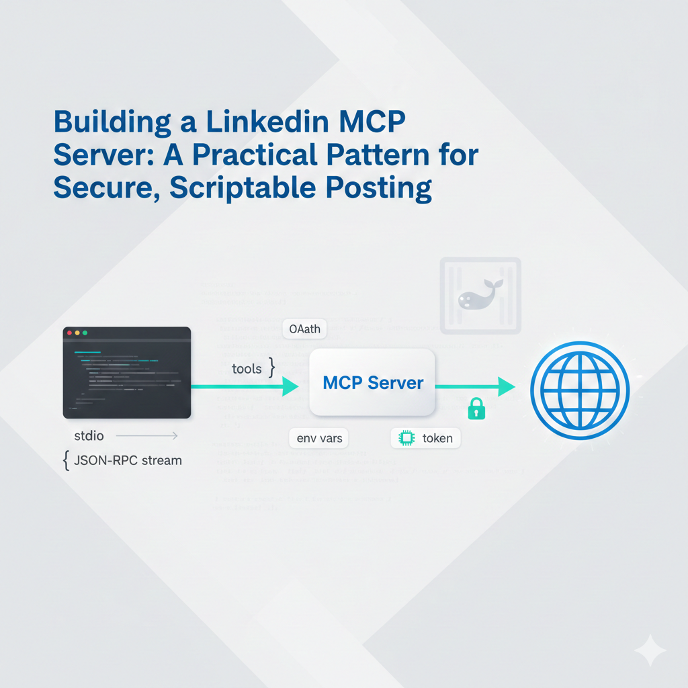

# LinkedIn MCP Server (Python, stdio)
[](https://github.com/hashan-silva/linkedin-mcp-server/actions/workflows/sonarcloud.yml)
[](https://github.com/hashan-silva/linkedin-mcp-server/actions/workflows/docker-publish.yml)

Minimal Model Context Protocol (MCP) server that speaks JSON-over-stdio for use with Codex CLI. It wraps LinkedIn REST endpoints so an agent can fetch your profile.

> You will need a valid LinkedIn OAuth access token with the appropriate scopes. Tokens are **not** handled here; provide them via env vars.



## Features
- Get profile
- Get verification report
- Get userinfo
- Create text-only post
- Create reshare post
- Create image post (register upload, upload binary, publish)
- Create multi-image post
- Create article post

## Project layout
```
src/
  linkedin_client.py    # HTTP wrapper around LinkedIn REST
  mcp_server.py         # JSON-RPC/stdio MCP server exposing tools
requirements.txt        # Python deps (requests)
Dockerfile
```

## Run locally (stdio)
```bash
python3 -m venv .venv
source .venv/bin/activate
pip install -r requirements.txt
export LINKEDIN_ACCESS_TOKEN="<your-token>"
# optional: override API base
# export LINKEDIN_BASE_URL="https://api.linkedin.com"
python -m src.mcp_server
```

The server stays attached to stdio. Configure Codex CLI to use the stdio command (see below).

### Built-in OAuth helper (fetch token on start)
If you have a LinkedIn app client ID/secret and want the server to launch a local redirect catcher:
```bash
export LINKEDIN_CLIENT_ID="your-client-id"
export LINKEDIN_CLIENT_SECRET="your-client-secret"
export LINKEDIN_REDIRECT_URI="http://127.0.0.1:8765/callback"  # must match your app config
# optional: scopes (space-separated)
# export LINKEDIN_SCOPE="r_liteprofile w_member_social"
python -m src.mcp_server --auth
```
It will print an authorization URL; open it in a browser, approve, and the server will start with the fetched access token. You can still provide LINKEDIN_ACCESS_TOKEN directly if you already have one.

## Docker
Build and run:
```bash
docker build -t linkedin-mcp-server .
docker run --rm -e LINKEDIN_ACCESS_TOKEN="$LINKEDIN_ACCESS_TOKEN" linkedin-mcp-server
```

Run with an alternate base URL (e.g., sandbox or proxy):
```bash
docker run --rm -e LINKEDIN_ACCESS_TOKEN=... -e LINKEDIN_BASE_URL=https://api.linkedin.com linkedin-mcp-server
```

**Public image guidance:** Do not bake secrets into the image. Pass creds at runtime via `-e` or a bind-mounted `.env`:
```bash
docker run --rm --env-file .env linkedin-mcp-server
```
An example env file is provided in `.env.example`. Never commit your filled-in `.env`.

OAuth in Docker (fetch token on start):
```bash
docker run --rm \
  -p 8765:8765 \  # expose redirect port
  -e LINKEDIN_CLIENT_ID=... \
  -e LINKEDIN_CLIENT_SECRET=... \
  -e LINKEDIN_REDIRECT_URI=http://127.0.0.1:8765/callback \
  linkedin-mcp-server python -m src.mcp_server --auth
```
Open the printed URL, approve, and the container will start the MCP server with the token.

## Codex CLI config (stdio server)
Add to your `~/.codex/config.toml` (adjust paths as needed):
```toml
[mcp_servers.linkedin]
command = "docker"
args = ["run", "--rm","-i","-e","LINKEDIN_ACCESS_TOKEN", "hashan0314/linkedin-mcp-server"]
env = {"LINKEDIN_ACCESS_TOKEN"="<your_token>"}
startup_timeout_ms = 30000
```
Ensure the working directory is this repo (or set `cwd` if supported by your CLI).

## Exposed tools
- `get_profile` – fetch current profile (identityMe)
- `get_verification_report` – fetch verification report
- `get_userinfo` – fetch OpenID Connect userinfo profile
- `create_text_post` – create a text-only LinkedIn post
- `create_reshare` – reshare an existing LinkedIn post
- `initialize_image_upload` – register an image upload (returns image URN + upload URL)
- `upload_image_binary` – upload a local image file to the upload URL
- `create_image_post` – create a post with a single uploaded image
- `create_multi_image_post` – create a post with multiple uploaded images
- `create_article_post` – create a LinkedIn article post with a link

## Notes
- This is a lightweight JSON-RPC loop for MCP stdio. Validation is minimal; LinkedIn API errors are returned to the caller.
- Be mindful of LinkedIn API rate limits and scopes (e.g., r_liteprofile, etc.).
- If you see a 403 when creating posts or reshares, your access token likely lacks the required scopes or has expired; refresh it with `python -m src.mcp_server --auth`.
- The current developer tier behavior for posting/resharing has not been tested.
- No persistence beyond the LinkedIn API itself.

## Backlog / Future Work
- Public distribution without exposing secrets: deliver a brokered-token service (you host LinkedIn client secret and issue short-lived access tokens) or a managed MCP endpoint you run. Avoid embedding client secrets in public images or repos.

